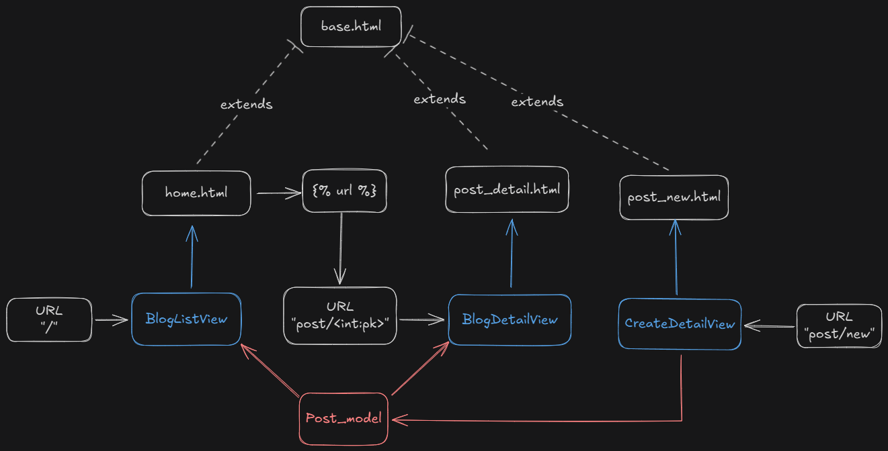

# Blog App

## Set Up inicial

- Criar o diretório do projeto `blog-app`
- iniciar um ambiente virtual
- Criar um app django `blog`
- Realizar a *migration* do banco de dados
- Atualizar as configurações de *settings*
    - Aplicações instaladas

## Models

De forma simplificada, cada usuário poderá possuir múltiplos posts, além de poder criar, alterar ou deletá-los. O ORM fornecido pelo framework Django foi utilizado para criar uma estrutura simples de post, apenas com referência ao usuário, título e corpo do post.

```python
class Post(models.Model):
    autor = models.ForeignKey(  # relacionamento N-1
        "auth.User",
        on_delete=models.CASCADE
    )
    titulo = models.CharField(max_length=100)
    corpo = models.TextField()

    def __str__(self):
        return self.autor, self.titulo

    def get_absolute_url(self):  # ainda não sei o que é
        return reverse("post_detail", kwargs={"pk": self.pk})
```

## Admin

Precisamos fazer com que a página de admin tenha acesso ao nosso modelo Post, para poder gerenciar de forma total esta tabela. Registramos então o modelo no arquivo *admin.py* da aplicação:

```python
from django.contrib import admin
from .models import Post

admin.site.register(Post)
```

## Views

Configuramos as *views* para linkar os nossos *models* com os nossos *templates*. Para isso, foi criada uma view para listar todas instâncias do nosso modelo *Post* no template *home.html*  e uma segunda view que renderiza uma única instância baseado em sua pk*.*

```python
from django.shortcuts import render
from django.views.generic import ListView
from .models import Post

# gera uma lista de instâncias
class BlogListView(ListView):
    model = Post
    template_name = "home.html"
    
# gera uma única instância do objeto
class BlogDetailView(DetailView):
    model = Post
    template_name = "post_detail.html"
```

## URL’s

Direcionamos a URL base para que fosse tratada na aplicação blog. Na aplicação, definimos as rotas da URL com as views:

```python
# django_project > urls.py
from django.contrib import admin
from django.urls import path, include

urlpatterns = [
    path('admin/', admin.site.urls),
    path('', include('blog.urls')),
]

# blog > urls.py
from django.urls import path
from .views import BlogListView

urlpatterns = [
    path('', BlogListView.as_view(), name='home'),
]
```

## Templates

Após estabelecer as rotas e relações das views com os modelos, podemos ter acesso às instâncias das tabelas relacionadas na view. Além disso, um template *base.html* é usado para reutilizar código (DRY), que é estendido por *home.html*.

Para facilitar o desenvolvimento da estilização das interfaces, realizamos a integração do Tailwind CSS com o framework Django, permitindo a estilização *utility first.* A documentação do *Django Tailwind* pode ser encontrada em: 

[Welcome to Django Tailwind’s documentation! — Django-Tailwind 2.0.0 documentation](https://django-tailwind.readthedocs.io/en/latest/index.html)

## Visão Geral



A URL root chama a view *BlogListView,* que renderiza o template *home.html* com o modelo de dados *Post*. Podemos usar uma tag django *url* para chamar uma outra rota `"post_detail" post.pk`  que aciona a view *BlogDetailView,* renderizando o template *post_detail.html* juntamente ao modelo *Post.* Ambos templates citados, estendem de *base.html.*